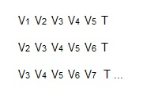

# IF707-REDES-NEURAIS

==============

Séries temporais

feed forward 

TDNN
  
  - treinamento 
  - validação -> Para não dá overfiting
  - teste
  
  O teste deve ser feito posteriormente
  
  O erro (alvo-previsto) é usado para o ajuste dos pesos
  
  Base de dados para treino
  
  Transformar um problema temporal em estático

Base de dados Paratreino

